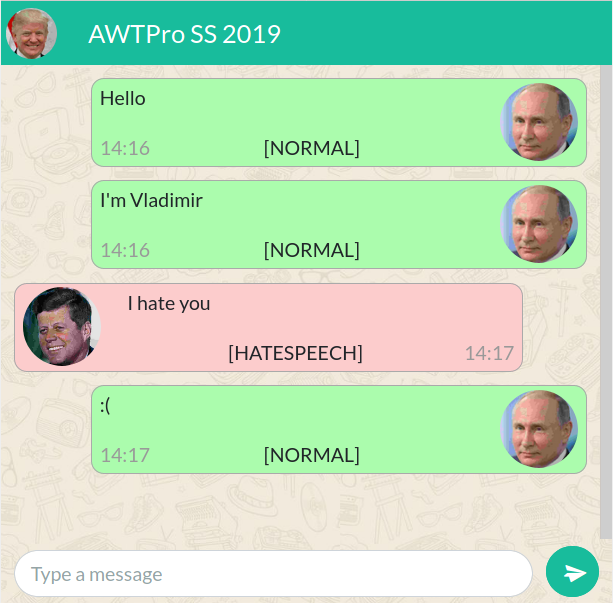

# About
This is a trained NLP classifier for hate speech and offensive language and a chat application that demonstrates it in real-time.

# Demo

Go to [uni.j95.io/chat](https://uni.j95.io/chat) to try it out yourself.
Type some messages into the chat and see if offensive messages, hatespeech or normal messages get classified correctly.

It's mobile friendly and you automatically get an identity assigned based on your IP.
You can chat with who ever else is in the chatroom at the time.
Your messages will then be labeled in real time.

Features also include relabeling messages based on the larger context of what a user wrote.
If this feature: "Automatic relabeling feature" is activated, the system takes the broader context of what you said over multiple messages into account.

__Example:__ If you type "You" and in the next message "Suck", these to messages indiviually are not considered offensive, but taken together they are.

# Implementation

## Classifier

We used the [ULMFiT](http://nlp.fast.ai/category/classification.html) transfer learning model, which was pretrained on Wikipedia articles to understand language.
It was then trained on labeled bullying data from Formspring and Twitter.

## Demo Chat App

The chat app that we built to demonstrate the classifier with real-time labeling of chat messages is implemented as a Django app.

